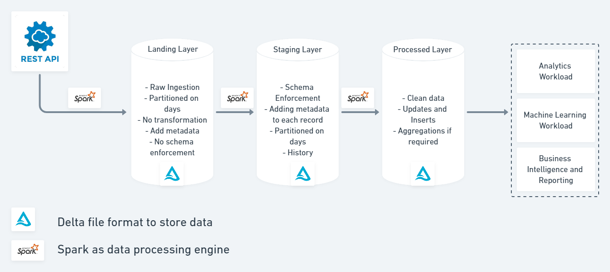

# Big Data Ingestion Pipeline
Simple ingestion pipeline to ingest data from REST API on daily basis.

## Architecture

### Architecture Components

#### Landing Layer
* Stores the raw data as is i.e. single REST API response
* Adds metadata information such as data source, timestamp etc.
* No Schema enforcement
* No transformations
* Stores data in delta file format

#### Staging Layer
* Data stored in a structure way with schema enforcement
* Maintains history
* Transformations are applied
* Stores data in delta file format
* Partitioned on date

#### Processed Layer
* Data stored in a structured way with schema enforcement
* Keeps only updated data.
* Stores data in delta file format
* Partitioned on date

## Technology Stack

* Python
* Spark
* SQL
* Databricks
* Delta

## Why 'Delta' as a file format ?

* Reliability and Data Quality - Atomicity
* Authenticity - Schema enforcement on write as opposed to throwing error during reads in downstream processes
* Versioning the data - Time Travel 
* Metadata Management in a reliable way.
* Support for UPSERT - Update or Insert based on requirement
* Schema merge and schema evolution

## Data Source

`https://bikeindex.org/api/v3/search`

## Orchestration and Scheduling

The requirement is to ingest data on daily basis from REST API. This could be
achieved in a several ways such as scheduling a cron job, 
orchestration using airflow or aws stepfunctions as per requirements. 
This solution does not include scheduling of the job rather it has data pipeline solution which
could be manually triggered daily and perform ingestion.

## Replicating the Solution

* Login to Databricks Account
* Create a spark cluster
* Import this repo to your desired workspace
* Note: For community edition github integration might note be available
so you will have to manually import all notebooks to your workspace.

## Conclusion

* The above architecture holds clean and structured data in `processed layer` which
could be leveraged by any downstream process without being worrying about
how ingestion is taking place in the upstream.

* The data stored in `staging layer` is not de-duplicated it captures the records as and when they arrive
thus preserving the history of each incident.

